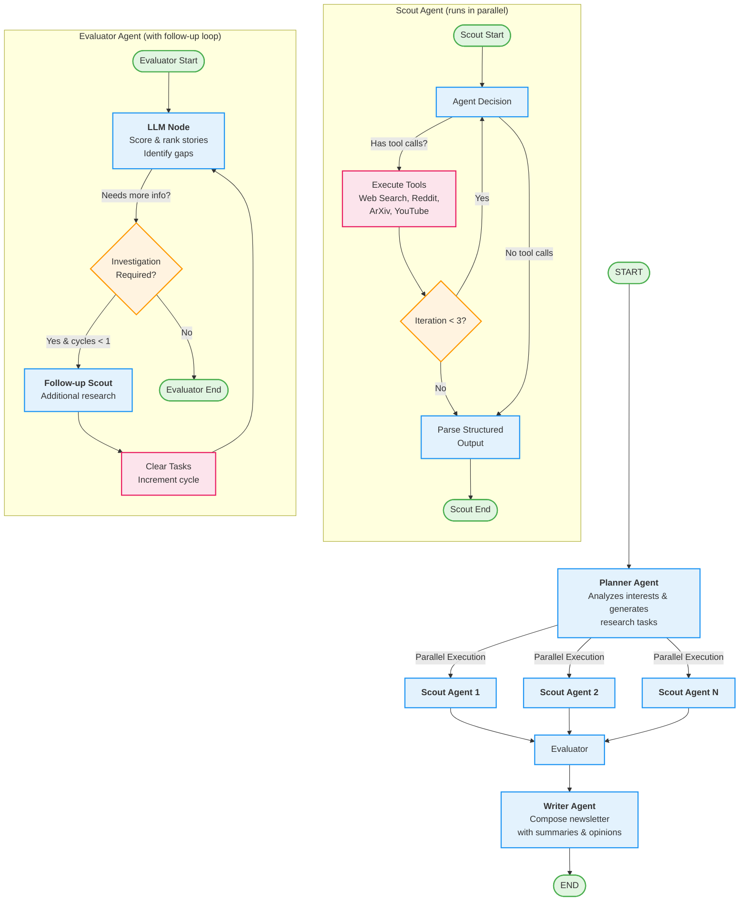

# 🏗️ TheThinkle.ai Architecture

## Overview

TheThinkle.ai is built as a **multi-agent system** using [LangGraph](https://github.com/langchain-ai/langgraph), demonstrating advanced agentic patterns including parallel execution, conditional routing, stateful workflows, and recursive subgraphs.

## System Architecture



## Agent Descriptions

### 1. 🎯 Planner Agent

**Responsibility**: Strategic planning and task generation

**Process**:
- Reads user interests from configuration
- Analyzes current date and user profile
- Generates targeted research tasks (up to `max_tasks`)
- Each task includes topic and additional context

**Output**: List of `ResearchTask` objects for scout agents

**Model**: Configurable (default: `gpt-5`)

**Key Features**:
- Structured output using Pydantic models
- Context-aware task generation
- Balances breadth vs. depth based on interests

---

### 2. 🔍 Scout Agent (Parallel Execution)

**Responsibility**: Information gathering from multiple sources

**Process**:
- Receives a single `ResearchTask` from planner
- **Runs as a subgraph** with tool-calling loop:
  1. Agent decides which tools to call
  2. Executes tools (web search, Reddit, ArXiv, YouTube)
  3. Reviews tool results
  4. Repeats up to 3 iterations
  5. Produces structured `NewsStory` output

**Available Tools**:
- `web_search`: Google/DuckDuckGo search
- `reddit_search`: Reddit discussions
- `arxiv`: Academic papers
- `youtube_transcript_api`: Video transcripts

**Output**: List of `NewsStory` objects with metadata

**Model**: Configurable (default: `gpt-5-mini`)

**Key Features**:
- **Parallel execution** via `Send` primitives
- Tool iteration limiting prevents infinite loops
- Graceful JSON parsing with fallback extraction
- Each scout runs independently and concurrently

---

### 3. ⚖️ Evaluator Agent

**Responsibility**: Content scoring, ranking, and gap analysis

**Process**:
- **Runs as a subgraph** with conditional routing:
  1. Receives all stories from scouts
  2. Scores and ranks based on relevance, quality, recency
  3. Identifies information gaps or missing perspectives
  4. Optionally triggers follow-up scout investigations
  5. Limits follow-up cycles to 1 to prevent recursion

**Output**: 
- Filtered and ranked `NewsStory` list
- Optional `InvestigatorTasks` for follow-up

**Model**: Configurable (default: `gpt-5`)

**Key Features**:
- **Recursive subgraph** with follow-up capability
- User profile-aware scoring
- Deduplication and story merging
- Bounded recursion (max 1 follow-up cycle)

---

### 4. ✍️ Writer Agent

**Responsibility**: Newsletter composition

**Process**:
- Receives final ranked stories
- Generates cohesive newsletter with:
  - Engaging headlines
  - Concise summaries
  - Optional opinions/hot takes
  - Source citations
  - "Dig deeper" sections
- Formats as Markdown

**Output**: Complete newsletter as `Report` string

**Model**: Configurable (default: `gpt-5`)

**Key Features**:
- Tone customization (witty, professional, casual, academic)
- Opinion injection (if enabled)
- Structured markdown output
- Personalized to user profile

---

## Advanced LangGraph Patterns

### 1. **Parallel Execution**

```python
def generate_scout_tasks(state: PlannerState):
    return [
        Send("scout", {"AssignedTask": task, "config": state["config"]}) 
        for task in state["ScoutTasks"]
    ]
```

The planner uses `Send` primitives to dispatch multiple scouts in parallel, maximizing throughput.

### 2. **Subgraphs with Tool Loops**

Scout agents are implemented as **compiled subgraphs** with:
- Internal state management
- Tool execution loops
- Conditional branching based on iterations

### 3. **Recursive Subgraphs**

The evaluator uses a **recursive subgraph** pattern:
- Can spawn new scout investigations
- Tracks recursion depth to prevent infinite loops
- Accumulates results across cycles

### 4. **Conditional Routing**

```python
graph.add_conditional_edges("planner", generate_scout_tasks)
graph.add_conditional_edges("llm", router_node, {"end": END})
```

Dynamic routing based on state enables adaptive workflows.

### 5. **Stateful Workflows**

Uses typed dictionaries and Pydantic models for:
- Type safety
- Structured outputs
- State accumulation across nodes

---

## State Management

### PlannerState

```python
class PlannerState(TypedDict):
    config: ThinkleConfig
    ScoutTasks: List[ResearchTask]
    NewsStories: List[NewsStory]
    Report: str
```

The main state flows through all agents, accumulating results.

### ScoutState

```python
class ScoutState(TypedDict):
    AssignedTask: ResearchTask
    config: ThinkleConfig
    messages: List[BaseMessage]
    tool_iterations: int
    NewsStories: List[NewsStory]
```

Individual scout state includes tool iteration tracking.

### EvaluatorState

```python
class EvaluatorState(TypedDict):
    config: ThinkleConfig
    NewsStories: List[NewsStory]
    InvestigatorTasks: List[ResearchTask]
    followup_cycles: int
    messages: List[BaseMessage]
```

Evaluator tracks follow-up cycles and investigation tasks.

---

## Data Flow

```
User Config (interests.yaml)
    ↓
[Planner] → Research Tasks
    ↓
[Scout 1, Scout 2, ..., Scout N] → News Stories (parallel)
    ↓
[Evaluator] → Ranked Stories + Optional Follow-ups
    ↓ (may loop back to Scouts)
[Evaluator] → Final Story List
    ↓
[Writer] → Markdown Newsletter
    ↓
Output File (data/outputs/)
```

---

## Configuration

Agents are configured via `config/interests.yaml`:

```yaml
models:
  planner: "gpt-5"         # Strategic planning
  scout: "gpt-5-mini"      # Fast parallel research
  evaluator: "gpt-5"       # Quality scoring
  writer: "gpt-5"          # Creative writing

max_tasks: 3               # Max parallel scouts
```

This allows fine-tuning cost vs. quality tradeoffs.

---

## Error Handling & Resilience

1. **Tool Iteration Limits**: Scouts cap at 3 tool calls to prevent runaway costs
2. **Follow-up Cycle Limits**: Evaluator allows max 1 recursive cycle
3. **Graceful JSON Parsing**: Handles malformed LLM outputs with regex extraction
4. **Pydantic Validation**: Catches schema errors before state corruption
5. **Type Safety**: TypedDict ensures state contracts across nodes

---

## Observability

### LangSmith Integration

The system includes built-in tracing:

```python
os.environ["LANGSMITH_TRACING"] = "true"
os.environ["LANGSMITH_PROJECT"] = "thethinkle"
```

This enables:
- Full execution traces
- Token usage tracking
- Latency profiling
- Error debugging

### LangGraph Studio

Debug visually with:

```bash
make studio
# or
langgraph dev
```

Features:
- Interactive graph visualization
- Step-through execution
- State inspection at each node
- Replay and modification

---

## Design Decisions

### Why LangGraph?

1. **Stateful Orchestration**: Managing complex multi-agent state
2. **Parallel Execution**: Built-in support for concurrent agents
3. **Subgraphs**: Modular agent encapsulation
4. **Conditional Routing**: Dynamic workflow adaptation
5. **Observability**: LangSmith integration for production debugging

### Why Multiple Model Configs?

- **Scout** uses cheaper `gpt-5-mini` since it runs many times in parallel
- **Planner/Evaluator/Writer** use `gpt-5` for strategic thinking
- Balances cost vs. quality across the pipeline

### Why Limit Recursion?

Without bounds:
- Scouts could loop infinitely on ambiguous results
- Evaluators could spawn endless follow-ups
- Costs would spiral

Limits provide **safety guardrails** while allowing adaptive behavior.

---

## Performance Characteristics

**Typical Newsletter Generation**:
- **Planner**: 1 call (~5 seconds)
- **Scouts**: 3 parallel calls × 2-3 tool iterations (~15-30 seconds)
- **Evaluator**: 1-2 calls (~10-15 seconds)
- **Writer**: 1 call (~10 seconds)

**Total**: ~40-60 seconds for a full newsletter

**Optimization opportunities**:
- Increase `max_tasks` for more scouts (higher cost, more coverage)
- Use faster models for scouts (`gpt-5-mini`)
- Implement caching for repeated searches

---

## Future Architecture Enhancements

- [ ] **Memory/RAG**: Remember past newsletters to avoid repetition
- [ ] **Human-in-the-loop**: Allow user approval before writer
- [ ] **Streaming**: Real-time progress updates
- [ ] **Distributed Execution**: Scale scouts across multiple machines
- [ ] **Feedback Loop**: Learn from user ratings of stories
- [ ] **Multi-modal**: Incorporate images, charts, videos

---

## References

- [LangGraph Documentation](https://langchain-ai.github.io/langgraph/)
- [LangChain Agent Patterns](https://python.langchain.com/docs/modules/agents/)
- [Pydantic V2](https://docs.pydantic.dev/latest/)
- [LangSmith Tracing](https://docs.smith.langchain.com/)

---

**Built with LangGraph** 🦜🔗
